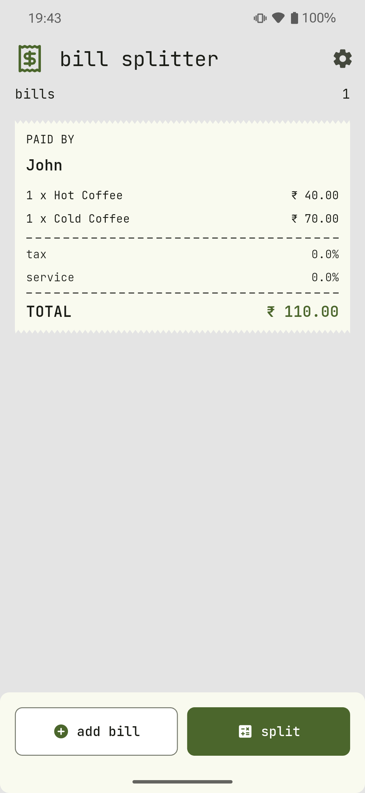
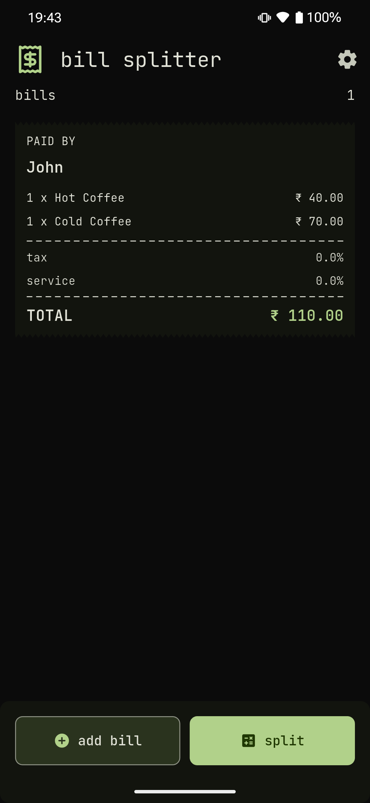
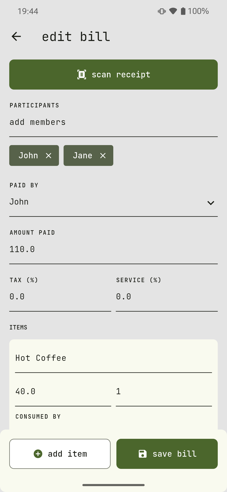
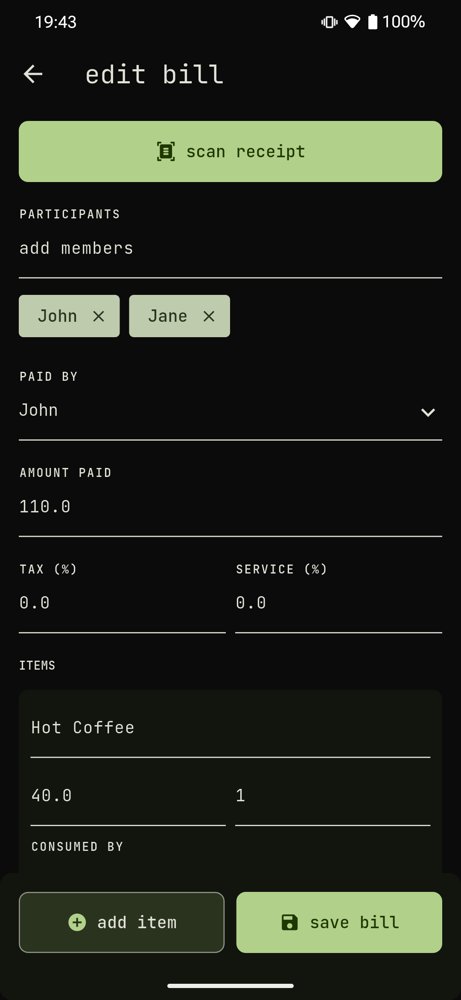

# Bill Splitter Flutter (`bs_flutter`)

Flutter client for [bill-splitter](https://github.com/ksdfg/bill-splitter).

## Features

- Split bills among friends with a text export of who pays whom and how much
- Supports light and dark themes, Material You dynamic color support
- Handles share intents for image uploads via OCR
- App Shortcut for quickly creating a new bill

## Screenshots

| Home (Light)                              | Home (Dark)                             |
|-------------------------------------------|-----------------------------------------|
|  |  |

| Edit Bill (Light)                         | Edit Bill (Dark)                        |
|-------------------------------------------|-----------------------------------------|
|  |  |

## Tech Stack

- **Framework:** Flutter (Material 3)
- **State Management:** `flutter_bloc` (BLoC pattern)
- **Navigation:** `go_router`
- **Networking:** `dio`
- **Local Storage:** `hive_ce`
- **Models/Codegen:** `freezed`, `json_serializable`, `build_runner`
- **Dependency Injection:** `get_it`

## Getting Started

### Prerequisites

- Flutter SDK

### Install and Run

1. Install dependencies

```bash
flutter pub get
```

2. Generate code

```bash
dart run build_runner build
```

3. Run the app

```bash
flutter run lib/main.dart
```